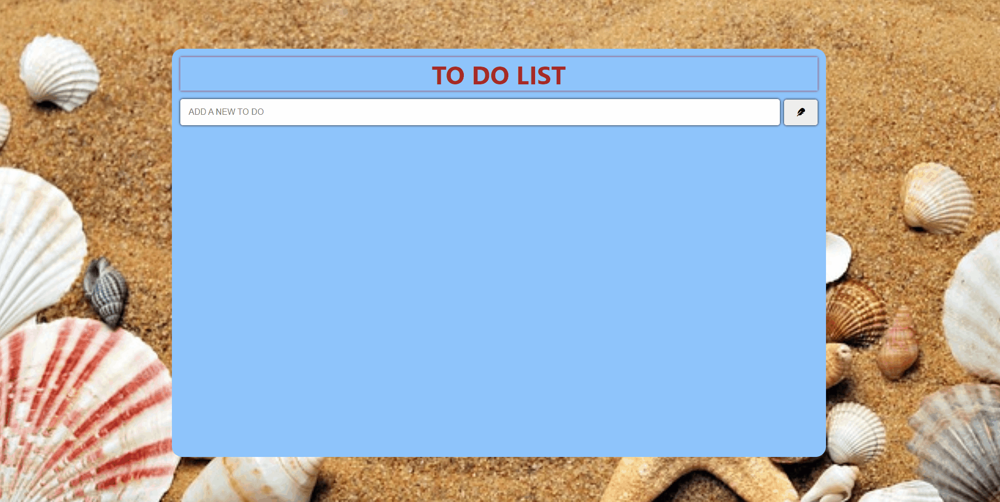

# To-Do List

  

## About the Project

A simple To-Do List web application where you can add tasks, mark them as completed, and delete them.

## Technologies Used
- HTML
- CSS
- JavaScript
- Font Awesome for icons

## Features
- Add new tasks to your to-do list.
- Mark tasks as completed by clicking on them.
- Delete tasks from the list.
- Responsive design for various screen sizes.

## Project Structure
- `index.html`: Main HTML file containing the structure of the webpage.
- `style.css`: CSS file containing styles for the webpage.
- `app.js`: JavaScript file containing the logic for the To-Do List functionality.

## Usage
- Enter a new task in the input field and press the "Add" button or press "Enter" on your keyboard.
- Click on a task to mark it as completed (strikethrough effect).
- Click on the trash icon to delete a task.
- Use the "Delete Finished Tasks" button to remove completed tasks from the list.